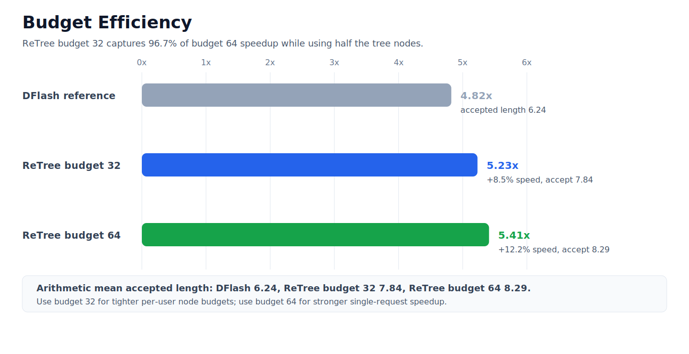
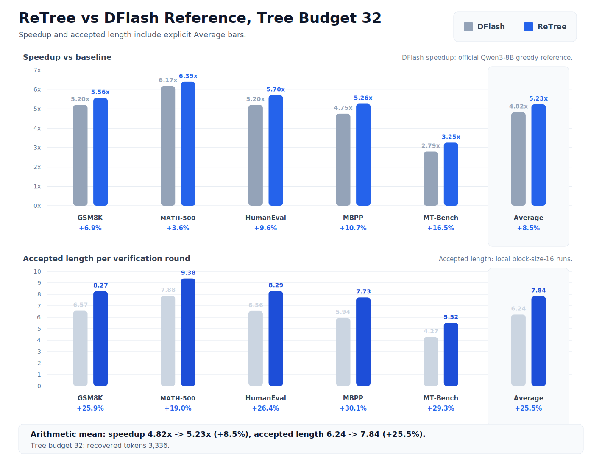
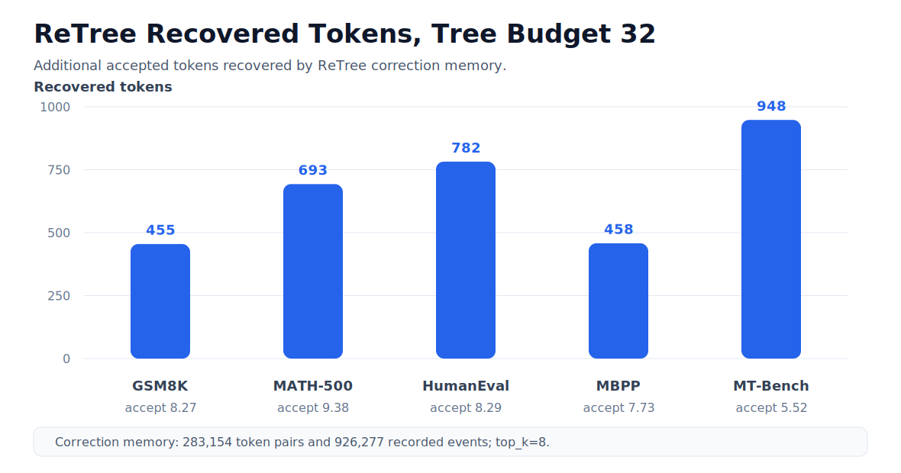
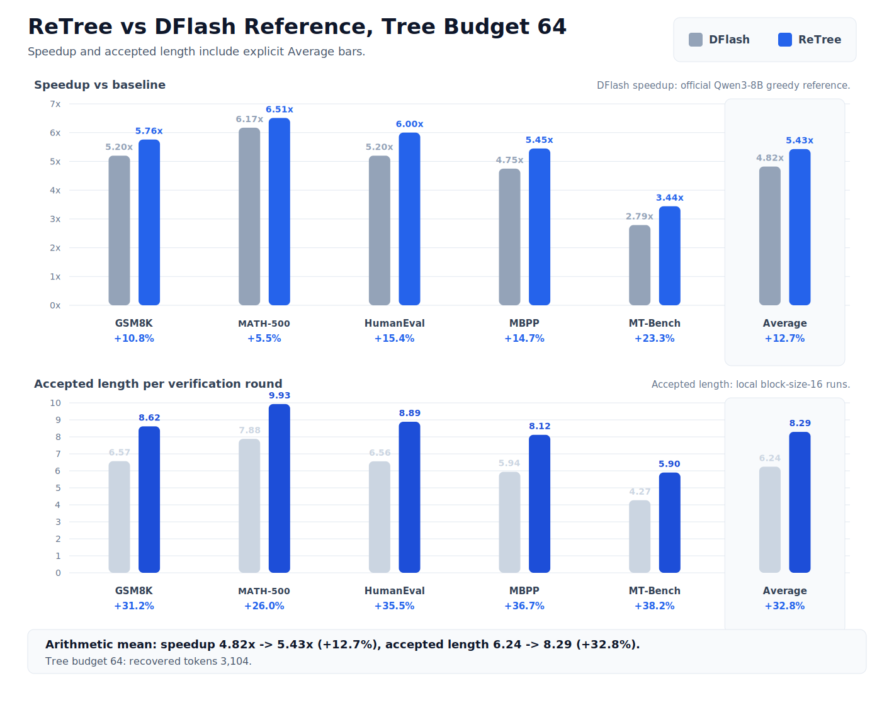
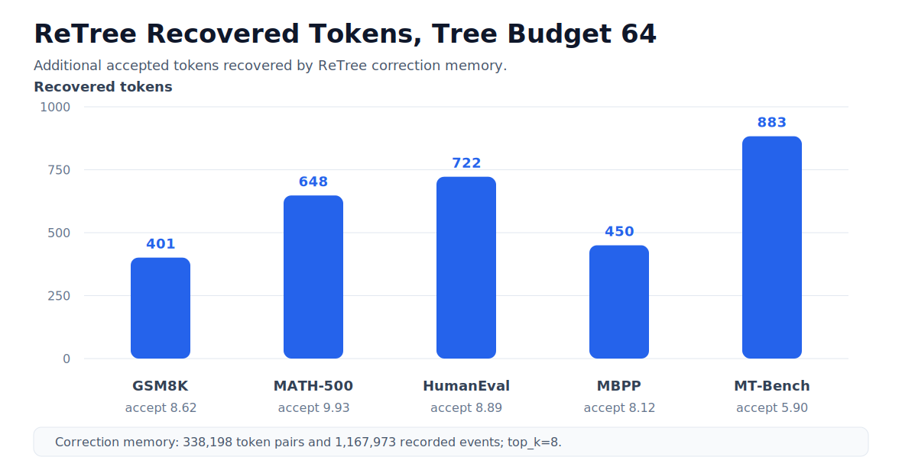

# ReTree

Paper: coming soon | Target: [Qwen/Qwen3-8B](https://huggingface.co/Qwen/Qwen3-8B) | Draft: [z-lab/Qwen3-8B-DFlash-b16](https://huggingface.co/z-lab/Qwen3-8B-DFlash-b16) | DFlash reference: [z-lab/dflash](https://github.com/z-lab/dflash)

ReTree is a tree-structured speculative decoding prototype for DFlash-style
block draft models. It expands a compact speculative tree from draft logits,
verifies all candidate nodes with one target-model pass, and uses a calibrated
correction memory to recover additional accepted tokens when target confidence
supports a frequent draft-to-target mismatch.

## Highlights

- Tree-structured verification for DFlash block drafts.
- Configurable tree budget for small-budget and high-speed settings.
- Correction-memory calibration for conservative token recovery.
- Benchmarks on GSM8K, MATH-500, HumanEval, MBPP, and MT-Bench.
- Current prototype uses SDPA for target tree attention; SGLang integration is
  in progress.

## Method

ReTree treats each draft block as a set of likely continuation paths instead of
a single linear proposal. For every decoding round, it builds a probability-
ranked tree under a fixed node budget, verifies the tree with the target model,
then commits the longest target-supported path.

At mismatch points, ReTree can still accept a candidate child when two checks
pass:

- the draft-to-target token pair is frequent in the calibrated correction
  memory, and
- the candidate token remains close enough to the target top token under the
  target logits.

This makes the recovery step conservative. ReTree only uses it after target
verification reaches a mismatch, and stop tokens are excluded from correction
memory updates and recovery decisions.

## Model Setup

ReTree follows the Qwen3-8B setup used by the DFlash Transformers example.

| Role | Model |
| --- | --- |
| Target model | [Qwen/Qwen3-8B](https://huggingface.co/Qwen/Qwen3-8B) |
| Draft model | [z-lab/Qwen3-8B-DFlash-b16](https://huggingface.co/z-lab/Qwen3-8B-DFlash-b16) |
| Reference implementation | [z-lab/dflash](https://github.com/z-lab/dflash) |

## Serving Motivation

Tree speculation is most useful when each request has a limited speculative
node budget. In continuous batching systems, giving one request a larger tree
can reduce capacity for other concurrent requests. ReTree is designed to make
small trees more effective, so each user can receive fewer speculative nodes
while still getting strong accepted-token length.

In the current SDPA prototype, ReTree with a 32-node tree reaches 5.23x average
speedup, while a 64-node tree reaches 5.41x. The 32-node setting therefore
captures 96.7% of the 64-node speedup while using half the tree budget. This is
the main serving signal: under tight per-user budgets, ReTree can keep most of
the benefit of a larger tree.

ReTree is being integrated into SGLang-style serving. The raw wall-clock
speedup in a serving backend may differ from official DFlash deployments, but
accepted length and budget efficiency are the key algorithmic signals to track.

Compared with tree-only speculative decoding work such as DDTree, ReTree's
main advantage is budget efficiency rather than simply expanding a larger
tree. The correction-memory recovery path helps a smaller speculative tree
retain useful target-supported branches after a mismatch, so a 32-node ReTree
run can approach the effect of a larger tree while spending fewer verification
nodes per request.

As a tree-only baseline context, the previous DDTree-style 64-node runs reached
4.99x average speedup in the same SDPA prototype setting. ReTree with a 32-node
tree reaches 5.23x, giving higher average speedup while using half the tree
budget.

| Dataset | Tree-only, budget 64 | ReTree, budget 32 | Delta |
| --- | ---: | ---: | ---: |
| GSM8K | 5.32x | 5.56x | +4.5% |
| MATH-500 | 6.32x | 6.39x | +1.1% |
| HumanEval | 5.69x | 5.70x | +0.2% |
| MBPP | 4.60x | 5.26x | +14.3% |
| MT-Bench | 3.04x | 3.25x | +6.9% |
| Average | 4.99x | 5.23x | +4.8% |

## Results

All ReTree results below use Qwen3-8B as the target model,
Qwen3-8B-DFlash-b16 as the draft model, block size 16, temperature 0.0, and the
SDPA target attention path for tree verification. The DFlash column is the
official Qwen3-8B greedy decoding reference reported by the DFlash project
page. Accepted-length numbers are measured from the local block-size-16 runs.
Summary rows use arithmetic mean.

### Budget Comparison



| Setting | Average speedup | Average accepted length |
| --- | ---: | ---: |
| DFlash reference | 4.82x | 6.24 |
| ReTree, budget 32 | 5.23x | 7.84 |
| ReTree, budget 64 | 5.41x | 8.29 |

### Tree Budget 32



The figure reports both speedup and accepted length, with an explicit Average
bar in each panel.

| Dataset | Samples | DFlash reference | ReTree | ReTree vs DFlash |
| --- | ---: | ---: | ---: | ---: |
| GSM8K | 128 | 5.20x | 5.56x | +6.9% |
| MATH-500 | 128 | 6.17x | 6.39x | +3.6% |
| HumanEval | 164 | 5.20x | 5.70x | +9.6% |
| MBPP | 128 | 4.75x | 5.26x | +10.7% |
| MT-Bench | 80 | 2.79x | 3.25x | +16.5% |
| Average | - | 4.82x | 5.23x | +8.5% |

| Dataset | DFlash accepted length | ReTree accepted length | ReTree recovered tokens |
| --- | ---: | ---: | ---: |
| GSM8K | 6.57 | 8.27 | 455 |
| MATH-500 | 7.88 | 9.38 | 693 |
| HumanEval | 6.56 | 8.29 | 782 |
| MBPP | 5.94 | 7.73 | 458 |
| MT-Bench | 4.27 | 5.52 | 948 |
| Average / Total | 6.24 | 7.84 | 3,336 |

For exact-match math benchmarks, ReTree reaches 89.1% on GSM8K and 78.1% on
MATH-500 while improving speed.



### Tree Budget 64



The figure reports both speedup and accepted length, with an explicit Average
bar in each panel.

| Dataset | Samples | DFlash reference | ReTree | ReTree vs DFlash |
| --- | ---: | ---: | ---: | ---: |
| GSM8K | 128 | 5.20x | 5.76x | +10.8% |
| MATH-500 | 128 | 6.17x | 6.51x | +5.5% |
| HumanEval | 164 | 5.20x | 6.00x | +15.4% |
| MBPP | 128 | 4.75x | 5.45x | +14.7% |
| MT-Bench | 80 | 2.79x | 3.33x | +19.4% |
| Average | - | 4.82x | 5.41x | +12.2% |

| Dataset | DFlash accepted length | ReTree accepted length | ReTree recovered tokens |
| --- | ---: | ---: | ---: |
| GSM8K | 6.57 | 8.62 | 401 |
| MATH-500 | 7.88 | 9.93 | 648 |
| HumanEval | 6.56 | 8.89 | 722 |
| MBPP | 5.94 | 8.12 | 450 |
| MT-Bench | 4.27 | 5.90 | 883 |
| Average / Total | 6.24 | 8.29 | 3,104 |

For exact-match math benchmarks, ReTree reaches 89.8% on GSM8K and 76.6% on
MATH-500.



## Setup

Install dependencies that match your CUDA and PyTorch environment:

```bash
pip install -r requirements.txt
```

For best DFlash draft performance, install FlashAttention separately if your
environment supports it.

## Quick Start

The launcher uses public model names by default:

```bash
MODEL_PATH=Qwen/Qwen3-8B \
DRAFT_PATH=z-lab/Qwen3-8B-DFlash-b16 \
TREE_BUDGET=32 \
METHODS=dflash,retree \
CORRECTION_THRESHOLD=0.01 \
CORRECTION_RECORD_TOP_K=8 \
CORRECTION_RECOVER_TOP_K=8 \
bash run_all.sh
```

To reproduce the five-task summary:

```bash
TASKS="gsm8k:128 math500:128 humaneval:164 mbpp:128 mt-bench:80" \
METHODS=dflash,retree \
bash run_all.sh
```

To run the benchmark after preparing a ReTree memory file:

```bash
torchrun --nproc_per_node=4 benchmark.py \
  --dataset gsm8k \
  --max-samples 128 \
  --model-name-or-path Qwen/Qwen3-8B \
  --draft-name-or-path z-lab/Qwen3-8B-DFlash-b16 \
  --block-size 16 \
  --tree-budget 32 \
  --methods dflash,retree \
  --correction-threshold 0.01 \
  --correction-record-top-k 8 \
  --correction-recover-top-k 8 \
  --correction-memory-file logs/retree_memory_calibrated.json
```

## Calibration

`calibrate.py` builds the correction memory used by ReTree:

```bash
python calibrate.py \
  --model-name-or-path Qwen/Qwen3-8B \
  --draft-name-or-path z-lab/Qwen3-8B-DFlash-b16 \
  --block-size 16 \
  --tree-budget 32 \
  --dataset gsm8k \
  --max-samples 2000 \
  --record-top-k 8 \
  --output-file logs/retree_memory_calibrated.json
```

Generated logs and memory files are ignored by git.

## Repository Layout

- `benchmark.py`: distributed benchmark entry point.
- `calibrate.py`: ReTree memory calibration.
- `dflash.py`: linear DFlash speculative decoding baseline.
- `tree.py`: tree construction, verification, and cache compaction helpers.
- `retree.py`: ReTree decoding with correction-memory recovery.
- `model/`: DFlash draft model and correction-memory utilities.
- `run_all.sh`: example calibration and benchmark launcher.

## Notes

- This repository is a research prototype and assumes CUDA-capable hardware.
- Current reported speedups are from the SDPA prototype path.
- ReTree is being connected to SGLang-style serving for future multi-user
  evaluation.
- Local model paths can be passed with `MODEL_PATH` and `DRAFT_PATH` instead of
  editing scripts.

## Related Work

- [DFlash](https://github.com/z-lab/dflash): block diffusion drafting for
  speculative decoding.
- DDTree-style dynamic tree verification: tree-structured verification for
  draft continuations under a fixed node budget.
- Speculative decoding: target-model verification for lossless accelerated
  generation.

## License

This project is released under the Apache License 2.0. See `LICENSE`.
