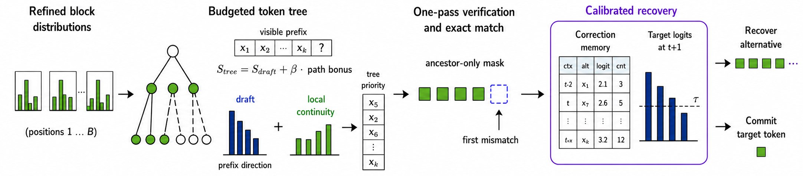
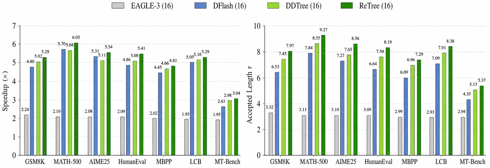
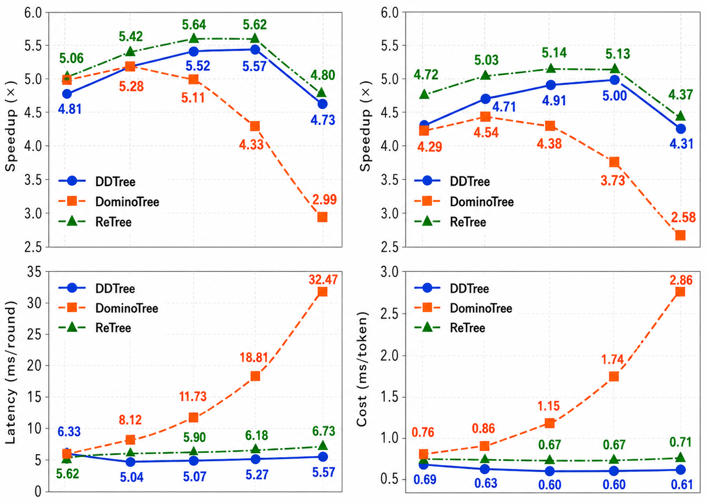
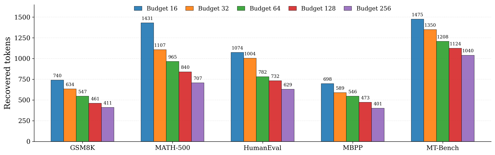

# ReTree

**Paper:** coming soon.

Target examples: [Qwen/Qwen3-4B](https://huggingface.co/Qwen/Qwen3-4B),
[Qwen/Qwen3-8B](https://huggingface.co/Qwen/Qwen3-8B) |
DFlash reference: [z-lab/dflash](https://github.com/z-lab/dflash)

ReTree is a training-free inference-time method for budget-efficient tree
speculative decoding with DFlash-style block draft models.

ReTree builds a request-aware speculative tree under a fixed node budget and
uses target-gated recovery to safely accept additional sibling tokens after the
first tree mismatch.

The code supports Qwen3-4B and Qwen3-8B DFlash draft checkpoints, DDTree-style
tree verification, and distributed benchmarking over math, code, and chat
tasks.

## Overview



At each decoding round, ReTree drafts a block distribution, constructs a
budgeted token tree, verifies the tree with one target-model pass, then commits
the longest target-supported path. If verification stops at a mismatch, the
recovery module can accept an alternative sibling only when the learned
recovery memory and target logits both support it.

In the benchmark logs, the full ReTree configuration is:

```bash
DDTREE_TREE_STRATEGY=rank_gated_ngram
python benchmark.py --methods dflash,ddtree,retree --recovery-memory-file ...
```

The printed method name `ReTree` is the full path-guided tree plus
target-gated recovery path. Plain `DDTree` under `rank_gated_ngram` is the
path-guided tree without recovery.

## Results

The representative low-budget result below is the Qwen3-4B,
temperature-0.0 comparison reported in the paper. All tree methods use a
16-node budget, DFlash uses block size 16, and evaluation covers GSM8K,
MATH-500, AIME25, HumanEval, MBPP, LiveCodeBench, and MT-Bench.



The full Qwen3-4B/Qwen3-8B summary and budget-sweep values are in
`assets/main_results_low_budget.csv` and
`assets/qwen3_4b_budget_sweep.csv`, respectively.

## Budget Sweep



The Qwen3-4B sweep compares DDTree, DominoTree, and ReTree over tree budgets
16, 32, 64, 128, and 256. ReTree improves throughput in the low-budget regime
while keeping construction latency close to DDTree.

## Recovery Statistics



Recovered-token counts show where Target-Gated Sibling Recovery contributes
extra accepted tokens after a mismatch. Counts are reported over the logged
Qwen3-4B temperature-0.0 five-task subset. The numeric values are stored in
`assets/recovery_counts_qwen3_4b_t0.csv`.

## Setup

Install dependencies that match your CUDA and PyTorch environment:

```bash
pip install -r requirements.txt
```

For best DFlash draft performance, install FlashAttention separately if your
GPU and PyTorch build support it. The repository defaults to SDPA for target
tree verification.

## Quick Start

Run one benchmark with path-guided tree construction and a calibrated recovery
memory:

```bash
DDTREE_TREE_STRATEGY=rank_gated_ngram \
DDTREE_NGRAM_BETA=0.15 \
DDTREE_NGRAM_RANK_CAP=8 \
torchrun --nproc_per_node=4 benchmark.py \
  --dataset gsm8k \
  --max-samples 128 \
  --model-name-or-path Qwen/Qwen3-8B \
  --draft-name-or-path z-lab/Qwen3-8B-DFlash-b16 \
  --block-size 16 \
  --tree-budget 16 \
  --max-new-tokens 2048 \
  --temperature 0.0 \
  --methods dflash,ddtree,retree \
  --recovery-memory-file recovery_memory/alltask/8B/tb16/recovery_alltask_8B_tb16.json \
  --recovery-freq-threshold 6 \
  --recovery-threshold 0.01 \
  --recovery-record-top-k 8 \
  --recovery-rescue-top-k 8
```

Build a task-level recovery-memory file:

```bash
DDTREE_TREE_STRATEGY=rank_gated_ngram \
python retree_calibrate.py \
  --model-name-or-path Qwen/Qwen3-8B \
  --draft-name-or-path z-lab/Qwen3-8B-DFlash-b16 \
  --block-size 16 \
  --tree-budget 16 \
  --dataset gsm8k \
  --max-samples 2000 \
  --max-new-tokens 512 \
  --temperature 0.6 \
  --record-top-k 8 \
  --output-file recovery_memory/calibration/8B/tb16_rankcap8/recovery_gsm8k_2000_8B_tb16.json
```

The full experiment launcher is configurable by environment variables:

```bash
MODEL_LIST="4B 8B" \
TB_LIST="16 32 64 128 256" \
MODEL_PATH_4B=/path/to/Qwen3-4B \
DRAFT_PATH_4B=/path/to/Qwen3-4B-DFlash-b16 \
MODEL_PATH_8B=/path/to/Qwen3-8B \
DRAFT_PATH_8B=/path/to/Qwen3-8B-DFlash-b16 \
LOCAL_DATASETS_ROOT=/path/to/huggingface-cache \
bash run_all.sh
```

Generated logs, recovery-memory files, and raw experiment notes are ignored by
git.

## Tree Strategy Knobs

- `DDTREE_TREE_STRATEGY=heap`: original DDTree heap construction.
- `DDTREE_TREE_STRATEGY=ngram`: request-local n-gram bonus for all candidate ranks.
- `DDTREE_TREE_STRATEGY=rank_gated_ngram`: n-gram bonus only for top-ranked
  candidate tokens; this is the default ReTree tree-construction variant.
- `DDTREE_NGRAM_BETA`: path-continuity bonus scale, default `0.15`.
- `DDTREE_NGRAM_RANK_CAP`: maximum candidate rank eligible for n-gram bonus,
  default `8`.
- `DDTREE_NGRAM_MAX_N`: maximum n-gram length, default `4`.
- `DDTREE_NGRAM_CONTEXT_WINDOW`: context window for local n-gram counts,
  default `2048`.

## Repository Layout

- `benchmark.py`: distributed benchmark entry point.
- `retree_calibrate.py`: offline recovery-memory calibration.
- `ddtree.py`: tree construction, one-pass verification, and cache compaction.
- `retree.py`: ReTree decoding path with target-gated sibling recovery.
- `dflash.py`: linear DFlash speculative decoding baseline.
- `model/recovery.py`: recovery memory and target-logit consistency gate.
- `model/dflash.py`: DFlash draft model implementation.
- `run_all.sh`: full calibration, all-task memory build, benchmark, and log-summary pipeline.

## Related Work

- [DFlash](https://github.com/z-lab/dflash): block diffusion drafting for
  speculative decoding.
- DDTree-style dynamic tree verification: tree-structured verification for
  draft continuations under a fixed node budget.
- DominoTree: high-acceptance tree construction with a larger construction-cost
  profile in the budget sweep.

## License

This project is released under the Apache License 2.0. See `LICENSE`.
