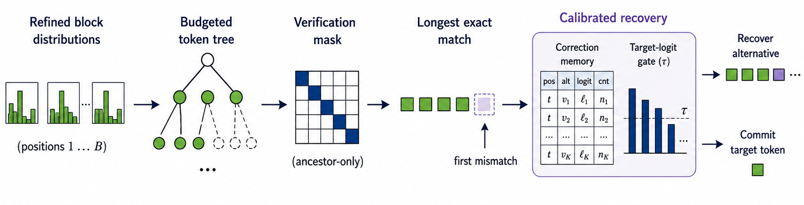
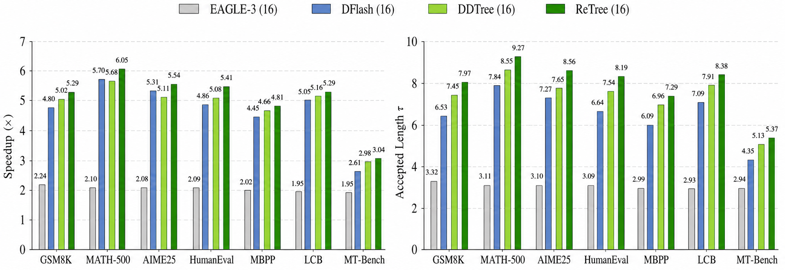

# ReTree

**Paper:** coming soon.

Target examples: [Qwen/Qwen3-4B](https://huggingface.co/Qwen/Qwen3-4B),
[Qwen/Qwen3-8B](https://huggingface.co/Qwen/Qwen3-8B) |
DFlash reference: [z-lab/dflash](https://github.com/z-lab/dflash)

ReTree is a training-free inference-time method for budget-efficient tree
speculative decoding with DFlash-style block draft models.

ReTree combines two pieces:

- **Path-Guided Tree Construction**: builds a fixed-budget candidate tree from
  draft logits plus request-local n-gram continuity.
- **Target-Gated Sibling Recovery**: uses a calibrated online correction memory
  and target-logit consistency checks to recover safe sibling tokens after the
  first tree mismatch.

The code supports Qwen3-4B and Qwen3-8B DFlash draft checkpoints, DDTree-style
tree verification, and distributed benchmarking over math, code, and chat
tasks.

## Overview


At each decoding round, ReTree drafts a block distribution, constructs a
budgeted token tree, verifies the tree with one target-model pass, then commits
the longest target-supported path. If verification stops at a mismatch, the
recovery module can accept an alternative sibling only when the correction pair
is frequent and the target logits still support it.



In the benchmark logs, the full ReTree configuration is:

```bash
DDTREE_TREE_STRATEGY=rank_gated_ngram
python benchmark.py --methods dflash,ddtree,ddtree_csd --csd-calibration-file ...
```

The printed method name `DDTree+CSD` is the ReTree recovery path. Plain `DDTree`
under `rank_gated_ngram` is the path-guided tree without recovery.

## Results

The main low-budget comparison uses a 16-node tree budget, block size 16, a
2048-token generation limit, and thinking disabled. Averages are arithmetic
means over GSM8K, MATH-500, AIME25, HumanEval, MBPP, LiveCodeBench, and
MT-Bench.



| Model | Temp. | Method | Avg. speedup | Avg. accepted length |
| --- | ---: | --- | ---: | ---: |
| Qwen3-4B | 0.0 | DFlash | 4.58x | 6.54 |
| Qwen3-4B | 0.0 | DDTree (16) | 4.81x | 7.31 |
| Qwen3-4B | 0.0 | ReTree (16) | **5.06x** | **7.86** |
| Qwen3-8B | 0.0 | DFlash | 4.53x | 6.49 |
| Qwen3-8B | 0.0 | DDTree (16) | 4.63x | 7.30 |
| Qwen3-8B | 0.0 | ReTree (16) | **4.82x** | **7.77** |
| Qwen3-4B | 1.0 | DFlash | 3.94x | 5.69 |
| Qwen3-4B | 1.0 | DDTree (16) | 4.33x | 6.60 |
| Qwen3-4B | 1.0 | ReTree (16) | **4.72x** | **7.38** |
| Qwen3-8B | 1.0 | DFlash | 3.74x | 5.48 |
| Qwen3-8B | 1.0 | DDTree (16) | 4.05x | 6.42 |
| Qwen3-8B | 1.0 | ReTree (16) | **4.41x** | **7.13** |

Full summary files are in `assets/main_results_low_budget.csv` and
`assets/qwen3_4b_budget_sweep.csv`.

## Budget Sweep


The Qwen3-4B sweep compares DDTree, DominoTree, and ReTree over tree budgets
16, 32, 64, 128, and 256. ReTree improves throughput in the low-budget regime
while keeping construction latency close to DDTree.

## Recovery Statistics


Recovered-token counts show where Target-Gated Sibling Recovery contributes
extra accepted tokens after a mismatch. Counts are reported over the logged
Qwen3-4B temperature-0.0 five-task subset. The numeric values are stored in
`assets/recovery_counts_qwen3_4b_t0.csv`.

## Setup

Install dependencies that match your CUDA and PyTorch environment:

```bash
pip install -r requirements.txt
```

For best DFlash draft performance, install FlashAttention separately if your
GPU and PyTorch build support it. The repository defaults to SDPA for target
tree verification.

## Quick Start

Run one benchmark with path-guided tree construction and a calibrated recovery
memory:

```bash
DDTREE_TREE_STRATEGY=rank_gated_ngram \
DDTREE_NGRAM_BETA=0.15 \
DDTREE_NGRAM_RANK_CAP=8 \
torchrun --nproc_per_node=4 benchmark.py \
  --dataset gsm8k \
  --max-samples 128 \
  --model-name-or-path Qwen/Qwen3-8B \
  --draft-name-or-path z-lab/Qwen3-8B-DFlash-b16 \
  --block-size 16 \
  --tree-budget 16 \
  --max-new-tokens 2048 \
  --temperature 0.0 \
  --methods dflash,ddtree,ddtree_csd \
  --csd-calibration-file ocm/merge/ocm_merged_16_8B.json \
  --csd-freq-threshold 6 \
  --csd-scg-threshold 0.01 \
  --csd-record-top-k 8 \
  --csd-rescue-top-k 8
```

Build a correction-memory file:

```bash
DDTREE_TREE_STRATEGY=rank_gated_ngram \
python csd_calibrate.py \
  --model-name-or-path Qwen/Qwen3-8B \
  --draft-name-or-path z-lab/Qwen3-8B-DFlash-b16 \
  --block-size 16 \
  --tree-budget 16 \
  --dataset gsm8k \
  --max-samples 2000 \
  --max-new-tokens 512 \
  --temperature 0.6 \
  --record-top-k 8 \
  --output-file ocm/new/ocm_gsm8k_8B_tb16.json
```

The full experiment launcher is configurable by environment variables:

```bash
MODEL_LIST="4B 8B" \
TB_LIST="16 32 64 128 256" \
MODEL_PATH_4B=/path/to/Qwen3-4B \
DRAFT_PATH_4B=/path/to/Qwen3-4B-DFlash-b16 \
MODEL_PATH_8B=/path/to/Qwen3-8B \
DRAFT_PATH_8B=/path/to/Qwen3-8B-DFlash-b16 \
LOCAL_DATASETS_ROOT=/path/to/huggingface-cache \
bash run_all.sh
```

Generated logs, OCM files, and raw experiment notes are ignored by git.

## Tree Strategy Knobs

- `DDTREE_TREE_STRATEGY=heap`: original DDTree heap construction.
- `DDTREE_TREE_STRATEGY=ngram`: online n-gram bonus for all candidate ranks.
- `DDTREE_TREE_STRATEGY=rank_gated_ngram`: n-gram bonus only for top-ranked
  candidate tokens; this is the default ReTree tree-construction variant.
- `DDTREE_NGRAM_BETA`: path-continuity bonus scale, default `0.15`.
- `DDTREE_NGRAM_RANK_CAP`: maximum candidate rank eligible for n-gram bonus,
  default `8`.
- `DDTREE_NGRAM_MAX_N`: maximum n-gram length, default `4`.
- `DDTREE_NGRAM_CONTEXT_WINDOW`: context window for local n-gram counts,
  default `2048`.

## Repository Layout

- `benchmark.py`: distributed benchmark entry point.
- `csd_calibrate.py`: offline correction-memory calibration.
- `ddtree.py`: tree construction, one-pass verification, and cache compaction.
- `ddtree_csd.py`: ReTree decoding path with target-gated sibling recovery.
- `dflash.py`: linear DFlash speculative decoding baseline.
- `model/csd.py`: online correction memory and semantic consistency gate.
- `model/dflash.py`: DFlash draft model implementation.
- `run_all.sh`: full calibration, merge, benchmark, and log-summary pipeline.

## Related Work

- [DFlash](https://github.com/z-lab/dflash): block diffusion drafting for
  speculative decoding.
- DDTree-style dynamic tree verification: tree-structured verification for
  draft continuations under a fixed node budget.
- DominoTree: high-acceptance tree construction with a larger construction-cost
  profile in the budget sweep.

## License

This project is released under the Apache License 2.0. See `LICENSE`.
